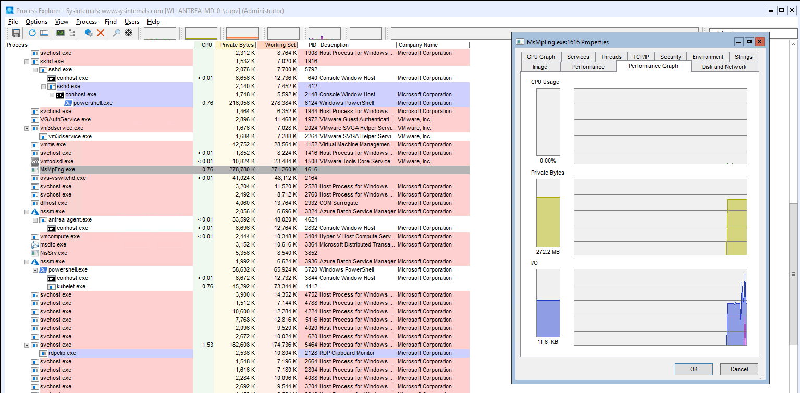
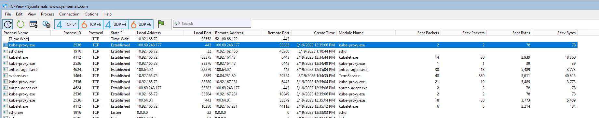
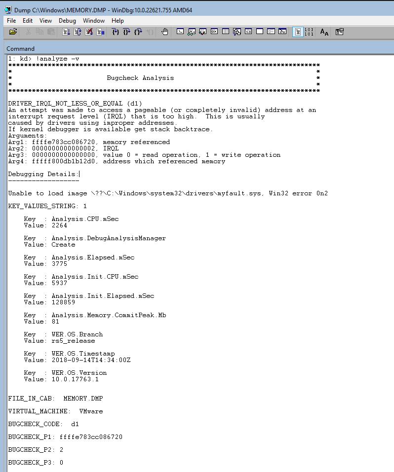

# Windows Introduction

Introductory chapter about MS Windows OS concepts and terms used in the book. Intro of the Windows 
[sysinternals](http://www.microsoft.com/technet/sysinternals). Summary of Windows Driver Kit (WDK),
Windows Software Development Kit (SDK).

## Versions

Accordingly the [MS site](https://learn.microsoft.com/en-us/windows-server/get-started/windows-server-release-info) 
the following versions are available as server Windows options.

| Windows Server Release | Servicing options | Availability  |
|-----------------------:|------------------:|-----------------:|
| Windows Server 2022    | LTSC              | 2021-08-18       |  
| Windows Server 2019    | LTSC              | 2018-11-13       |
| Windows Server 2016    | LTSC              | 2016-10-15       |

## Windows API

Ms core set of application programming interfaces available in MS OSs. 
Several implementations that are often referred to by their own names (win32 api)
Almost all Windows programs interact with the Windows API. Developer support
is implemented in a form a software development kit, or MS SDK. WinAPI mostly
focus on C. kernel32.dll is a core DLL exposing to applications most of the Win32 base API, such as memory mngmt,
input/output, process and thread creation, (linux equivalent = libc).

winRT or Windows Runtime is built on top of COM, adding various extensions to the base infrastructure
.NET fw is part of Windows, uses the CLR (common lang runtime) and FCL for user development support.
A few contexts for libraries and services:

* Windows API functions
* Native System Services (system calls)
* Kernel support functions (or routines)
* Windows Services
* Dynamic Link Libraries

## Processes

Program vs. Process with the following differences: Process has a private vritual adress space, 
an executable program, a list of open handlers, a security context, a processs ID and at least
one thread.



Jobs- Windows provides an extension of the process model called jobs, a job object main functions is to
allow the management and manipulations of a group of processes as a unit.

## Virtual Memory

Implements a virtual mem system based on flat address space, provides each process with illusion of having its
large address space. Translates and maps the virtual address into physical addr where the data is actually stored.
paging data to disk frees physical memory so that it can be used for other processes or for the OS itself.
When a thread accesses a vritual address that has been paged to disk, VMem manager loads the info back into memory from disk.

Address Windowing Extensions (AWE) allows 32-bit apps allocate up to 64Gb of physical memory.
64-bit windows provides 128 TB.

## Kernel mode vs. user mode

running processes in different modes (ring levels), providing the Os kernel with higher privileges level
than user model apps have, the processor provides a necessary foundation for OS designers to ensure 
misbehaving apps don't disrupt the system. User apps switch from user to kernel mode when they make a system
service call.



Windows provides DAC, Privileged access control and mandatory integrity control 

## Kernel debugging

Examining internal kernel data structures and steping through functions in the kernel
Useful way to investigate Windows int. Debugging tools:

1. cdb
2. kd
3. WinDBc
4. User-mode debuggers
5. Kernel-mode debuggers

Install the SDK with the following command

```
Invoke-WebRequest -URI "https://go.microsoft.com/fwlink/p/?linkid=2196241" -Out sdk.exe
sdk.exe
```

To force a crash you can run `notMyfault.exe /crash`

If KD or WinDbg is performing kernel-mode debugging, it can force a system crash to occur. This is done by entering the .crash (Force System Crash) command at the command prompt. (If the target computer does not crash immediately, follow this with the g (Go) command.)


